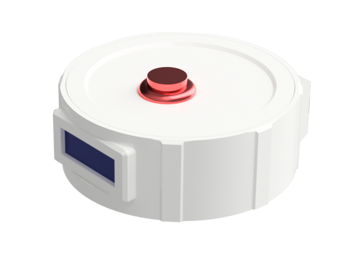

# Retro Web Connected Bedside Alarm Clock

## Introduction

I like the retro filling of a big push button & a LCD screen. However, I do appreciate the convenience of setting my alarm through Google assistant or the web.

This is why I built this retro outside / techno inside bedside alarm clock.

## Features

* MP3 custom alarm sound 
* Setup alarm through adafruit io
* Setup alarm through google assistant
* Alarm can be set active on the week, on the weekend or on both
* Brightness function of the time
* Snooze the alarm with a long press
* Stop the alarm with a short press
* Display/hide time with a short press
* Display alarms setup with a long press
* Alarms setup saved to DS1307 RAM
* OTA (to easily update)

## Google assistant

* Display the alarms configurations
* Display/hide time 
* Deactivate the alarm
* Set alarm time

## Components 

The following are the main components of the alarm clock:

* DS1307 real time clock 
* [Adafruit Feather Huzzah ESP8266](https://www.adafruit.com/product/2821)